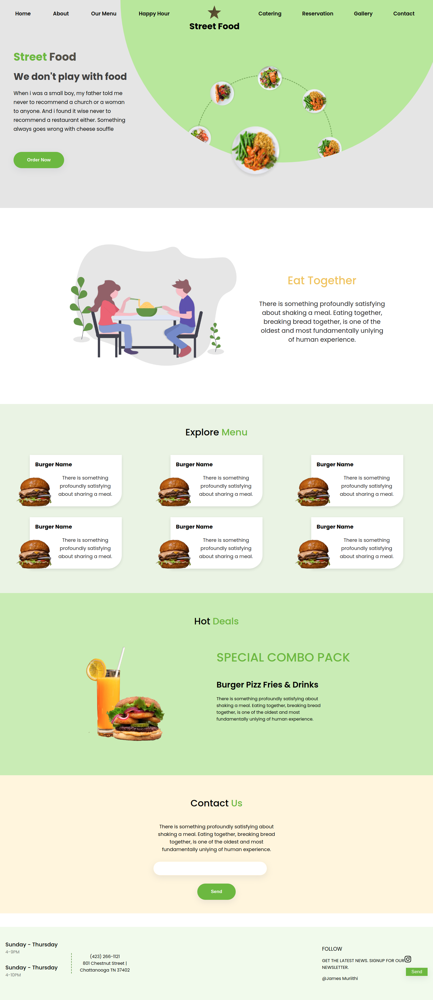
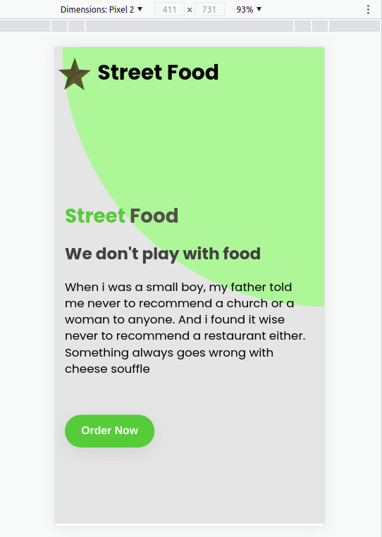

# Street Food
A street food responsive website implemented from a provided design.

## Description
Week 2 Moringa School Independent Project (IP). It's a Street food landing page showing all the Food they offer.

## Project Demo
[Here](https://james-muriithi.github.io/street-food/) is a link to the demo website

## Technologies Used
* HTML
* CSS

## Project Setup / Installation
Download the code and open the index.html file with a browser of your choice.

# Design

# Screenshots

# Support and contact
To make a contribution to the code used or any suggestions please feel free to reach out.
* Email: muriithijames556@gmail.com
* [Twitter](https://twitter.com/jam_es_muriithi)

# Licence
Copyright (c) 2021 Moringa school

Permission is hereby granted, free of charge, to any person obtaining a copy of this software and associated documentation files , to deal in the Software without restriction, including without limitation the rights to use, copy, modify, merge, publish, distribute, sublicense, and/or sell copies of the Software, and to permit persons to whom the Software is furnished to do so, subject to the following conditions:

The above copyright notice and this permission notice shall be included in all copies or substantial portions of the Software.

THE SOFTWARE IS PROVIDED "AS IS", WITHOUT WARRANTY OF ANY KIND, EXPRESS OR IMPLIED, INCLUDING BUT NOT LIMITED TO THE WARRANTIES OF MERCHANTABILITY, FITNESS FOR A PARTICULAR PURPOSE AND NONINFRINGEMENT. IN NO EVENT SHALL THE AUTHORS OR COPYRIGHT HOLDERS BE LIABLE FOR ANY CLAIM, DAMAGES OR OTHER LIABILITY, WHETHER IN AN ACTION OF CONTRACT, TORT OR OTHERWISE, ARISING FROM, OUT OF OR IN CONNECTION WITH THE SOFTWARE OR THE USE OR OTHER DEALINGS IN THE SOFTWARE.